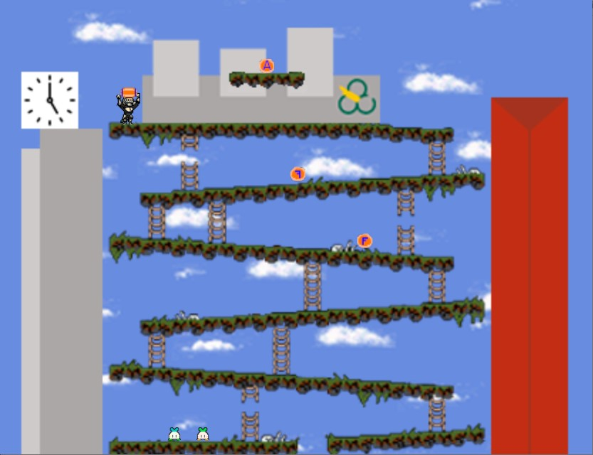

# Donkey Kong Arcade UFABC  

 

## Projeto desenvolvido para a disciplina de Engenharia Unificada II - 2022 

###  Criação de um game arcade utilizando: 

<h2 align="center">
    <a href="https://api.arcade.academy/en/latest/">🔗 Python Arcade</a>
</h2>

🚀 lib utilizada para criação de games arcarde

 
<h2 align="center">
    <a href="donkey-kong-arcade-UFABC.zip">🎮 Download do jogo</a>
</h2>

 

